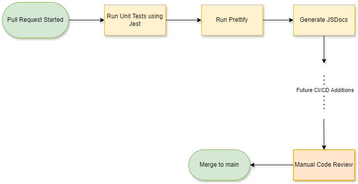

# Phase 1 CI/CD Pipeline Report

## Overview

Our team has implemented the first phase of our CI/CD pipeline as part of our software engineering project. This pipeline is currently triggered by the creation of a Pull Request and automates several key tasks to improve the maintainability and quality of our codebase.

## Functional Components

### 1. Unit Testing with Jest
- Upon creation of a Pull Request, the pipeline runs a suite of unit tests using [Jest](https://jestjs.io/).
- This ensures any introduced code does not break existing functionality.
- Test results are surfaced in the GitHub Actions interface for easy inspection.

### 2. Code Formatting with Prettier
- After unit tests pass, the codebase is formatted using [Prettier](https://prettier.io/).
- This helps maintain a consistent code style across team contributions and reduces the overhead during code reviews.

### 3. Automated Documentation with JSDoc
- Following formatting, [JSDoc](https://jsdoc.app/) is used to automatically generate updated documentation from our source code.
- This encourages thorough commenting and provides useful developer-facing documentation for project maintainability.

### 4. Manual Code Review Gate
- After the automated steps, the Pull Request must pass a **manual code review** by another developer.
- This introduces a human element to the vetting process and encourages peer collaboration and accountability.

### 5. Merge to Main
- Once the code passes automated checks and manual review, it can be merged into the main branch.

## Planned/Upcoming Features

These features are not implemented yet but are considered for Phase 2 or later:

### 🔜 Future CI/CD Additions
- **Code quality tools** (e.g., CodeClimate, SonarCloud) to evaluate maintainability and complexity.
- **Code coverage** tracking to ensure test thoroughness.
- **Branch protection rules** to enforce successful pipeline runs before merges.

## Technical Details

- The pipeline is implemented as a **GitHub Actions workflow**.
- Our blackjack project is used as a sandbox to safely experiment with and validate each pipeline step.
- Additional branches are used for testing the pipeline before integration into `main`.

## Conclusion

This Phase 1 pipeline lays the foundation for a robust CI/CD workflow. By integrating testing, formatting, and documentation checks early in the development process, we reduce the risk of bugs, promote clean code, and streamline future deployment automation.

---

