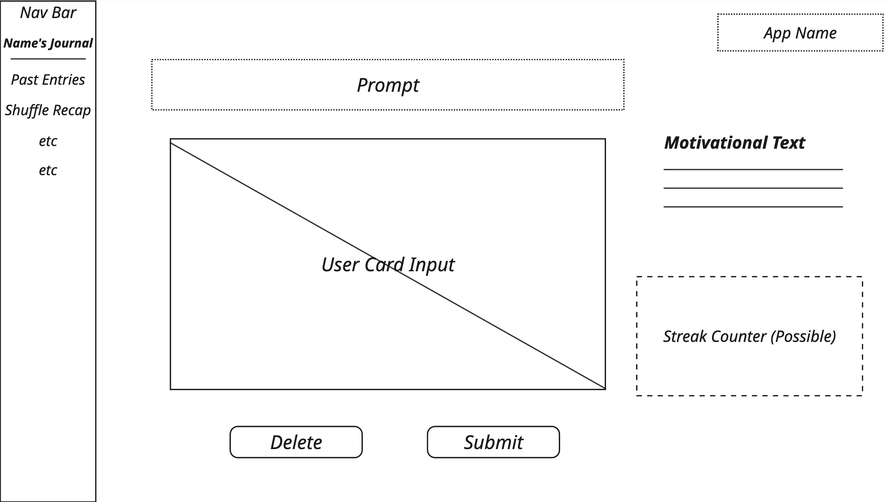
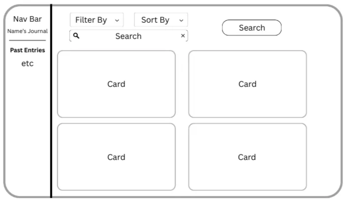

# Card Journal

# Statement of Purpose

Our project is a journaling app that invites users to begin each day with a single, thoughtfully designed card prompt — encouraging self-reflection, gratitude, or goal-setting in a way that feels both intentional and engaging. Whether a seasoned journaler or a complete beginner, our project is designed with users of any experience through its delicate and accessible process. By combining the simplicity of daily writing with the intrigue of a card draw, it turns journaling into a playful yet meaningful habit. Whether used for personal growth, mental wellness, or therapeutic practice, it offers just enough structure to keep users grounded without ever feeling overwhelmed. With customizable prompt decks, a clean, calming interface, and rich weekly recaps, it stands apart from traditional journaling apps by making reflection feel effortless, focused, and refreshingly human.

# User Personas

# Lawyer Lenny

- Lawyer at a big name law firm
- Works 60 hours per week
- Burnt out from work and wants to practice feeling gratitude
- Too busy with work to have time for a traditional journal
- Card journaling app allows him to practice mindfulness without taking up too much time
- Gamification keeps him motivated

# New-College Ned

- Just left home to go to college for the first time
- Feeling scared and overwhelmed in a new setting
- Journaling app can help him feel centered and calm before each day starts
- Being able to easily journal online will integrate well into the college student workflow

# Mary Mom

- New parent
- Very busy taking care of her baby and wants to remember every moment
- Not enough time to write in a traditional journal
- Sometimes forgets to take pictures or write down important moments in her child's life
- Journal prompts will allow her to record exciting things that happen in her baby's life
- In a couple years she will be able to look back and reminisce with her journal responses
- Her old journal responses will be good to show her child in the future

## Wellness Seeker

- Wants to build a daily reflection habit
- Full-length journaling feels too overwhelming sometimes
- Lightweight guided journaling would lower the barrier to entry
- Weekly reflections would help to analyze mood patterns

## Therapeutic Writer

- a person who is suffering from either psychological or physical issues who desperately needs a place to jot down their thoughts
- this person wants a way to feel better about themselves, or something that is bothering them, but can’t find the right questions to ask
- looking for a safe place they can express their emotions without the fear of their true thoughts being exposed or judged
- will greatly benefit from ai generated prompts that deal with mental health such as “write about how you felt about today?” or “what’s one kind thing you can say to yourself right now?”

## Bodybuilder

- a person with the goal of building up their muscles in a timely manner.
- this person is looking for a place they can keep track of their progress and write down exactly how much they worked out everyday in order to see how far they have come
- would benefit from prompts such as “how did the workout go today” or “remember to be kind to yourself. what are some ways you can do better than you did today”

# System Design

# Risks and Rabbit Holes

## **Risks:**

- **User Retention:**

Prompt-based journaling can be a fun and approachable way to encourage users to build new habits, but maintaining their engagement over time is a significant risk. Many users may start strong and enjoy the experience for the first few days, but without enough variety or a strong pull to return, their interest could quickly fade. It's important to consider ways to make the daily experience feel rewarding without overwhelming users with complexity or pressure.

- Themed journal/themed prompts
    - One way to make the user feel like journaling is worthwhile is to include a common theme between prompts. A theme should make the user feel like they are bettering themselves/doing something for themselves by journaling. Thus, a meaningful theme should focus on self-improvement and/or self-reflection.
- **Prompt Generation:**

Coming up with new and engaging prompts every day can quickly become a challenge if done manually. While automation might seem like a solution, there's a real risk that automatically generated prompts could feel repetitive, uninspired, or too generic. This could lead the user to get bored and make the journaling experience feel more like a chore than a meaningful activity. A balance between creativity and sustainability in prompt generation will be crucial.

- Meaningful prompts
    - Prompts should be open-ended but meaningful enough to allow the user to reflect on their life and their thoughts. Prompts should potentially provoke deeper thought into the user’s emotions and feelings; prompts should allow user to express feelings, thoughts, emotions.
- Prompts that call for action
    - Many users may take on journaling as a way to better themselves or strive toward self-improvement. Thus, prompts should also be a way for users to reflect on their life and habits, so that they can potentially think about concrete ways for self-improvement. Overall, prompts should lead to meaningful self-reflection.
- Sensitive prompts
    - Journaling can be a very personal experience, allowing for the user to express their personal thoughts and feelings. Thus, prompts should also be worded in a way that is sensitive, but is still meaningful in the sense that it provokes thought and self-reflection.
- **Privacy:**

Since journaling is personal to every user, protecting their privacy will be essential. Users need to trust that their responses and reflections are secure and confidential. If they sense that their data isn’t protected, they will be unlikely to continue using the platform. To address this, we will prioritize user privacy, and we may need to establish privacy policies and a visible terms of use agreement in the future to ensure we are meeting legal requirements and creating a safe space for user’s self-expression.

- **Web Rendering Performance:**

Given that journaling is meant to feel calm, responsive, and distraction-free, performance bottlenecks can significantly harm user engagement.It is critical to implement lightweight design principles, optimize resources aggressively (such as through lazy loading, code splitting, and image compression), and prioritize fast first meaningful paint (FMP) and time-to-interactive (TTI) to maintain a seamless user experience.

- **Cross-Platform Adaptability**

Since the application is expected to run on various platforms(including desktop browsers, tablets, and mobile devices), ensuring consistent rendering and user experience across different screen sizes and environments is crucial. Differences in WebView behavior across iOS and Android (such as font rendering, scrolling performance, and local storage restrictions) must also be considered, particularly if the app is later wrapped into a native shell. Responsive design, mobile-first development, and thorough cross-device testing are necessary to prevent fragmented or degraded experiences. Special attention should be paid to supporting small-screen devices, ensuring touch interactions feel natural, and maintaining usability even under constrained network or hardware conditions.

## **Rabbit Holes:**

- **Minimalist UI:**

While offering users flexibility in how they journal and respond to prompts might seem appealing, it comes with a risk of overcomplicating the user interface. Adding too many options or customization features could clutter the experience and move away from the clean design that makes our journaling platform easy to use. Staying disciplined about what features to include will be important to maintain a user-friendly, minimalist platform.

- Overuse of features
    - Too many features may take away from the purpose of journaling; the overuse of features may defeat the purpose of journaling as an activity to destress and reflect on oneself. Thus, we should focus on a minimalist UI that minimizes distracts.
        - Perhaps a consideration is to have a reminder when the user starts their session for the user to silence other notifications/minimize external distractions
- **Game-ification:**

Rewarding user engagement with game-ified features like streaks or badges can increase user motivation, but excessive gamification could potentially take away from having a clean UI for thoughtful journaling. We might incorporate simple and optional rewards if there are resources for it, making sure they don’t overpower the journaling experience.

- Potential consequence of game-ification
    - Rewarding user engagement with streaks or badges could also potentially detract from the purpose of journaling, which is to connect with one’s emotions and inner thoughts. This may make the user just treat journaling as another item to do, in order to maintain a “streak” or achieve a “badge,” ultimately defeating the purpose of journaling.
- **Weekly Recap:**

Automating weekly recap messages is an appealing idea to customize the user experience, however, this could require complex text-analysis, or AI integration to generate messages tailored to each user. This can be time-consuming and could go beyond the current scope of the project. For now, we plan to keep weekly recaps simple and avoid automated messages, saving more advanced features for potential future updates.

- However, one way to potentially make weekly recaps simple but more engaging/interesting for the user is to ask them what types of statistics they would like to see regarding their weekly usage.
    - Can display time spent, types of prompts responded to, summary about journal entry length, etc. → Would not require complex time analysis
